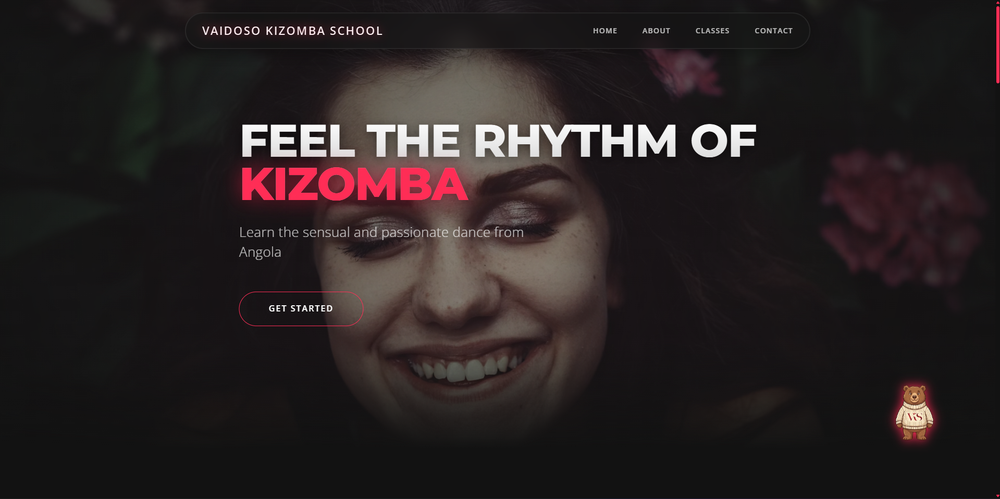
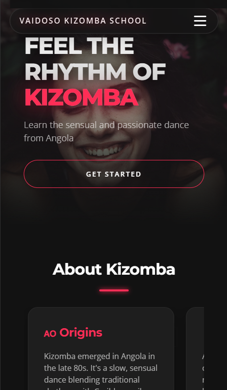

# Vaidoso Kizomba School Landing Page

A premium landing page for "Vaidoso Kizomba School," an Angolan dance academy. The design features a modern dark aesthetic with neon accents, glassmorphism effects, and fluid typography.

## Live Demo
[View Live Site](https://cmmarin.github.io/tum-web-lab2/)

## Topic & Features
This project is a high-energy, single-page website built with semantic HTML5 and **Tailwind CSS** (modular approach). 

**Key Features:**
*   **Tailwind CSS CLI:** Modular CSS with @apply directives for maintainability
*   **Pure CSS Interactivity:** Mobile navigation and interactions handled without JavaScript.
*   **Responsive Design:** Distinct desktop (grid-based) and mobile (horizontal snap-scroll) layouts.
*   **Visual Effects:** Ken Burns hero animation, glassmorphism cards, and "ghost" typography background elements.
*   **Theming:** Custom Tailwind configuration for a consistent Dark/Neon color scheme.

## Development Setup

### Prerequisites
- Node.js and npm installed

### Installation
```bash
npm install
```

### Build CSS
```bash
# Build once
npm run build:css

# Watch for changes (development mode)
npm run watch:css
```

### File Structure
- `tstyles.css` - Source Tailwind CSS file with @layer and @apply directives
- `output.css` - Compiled CSS file (generated, git-ignored)
- `tailwind.config.js` - Tailwind configuration with custom theme
- `index.html` - Main HTML file

## Screenshots

### Desktop View

*Full-screen hero section with immersive video/image background and grid layouts.*

### Mobile View

*Optimized mobile experience with horizontal swipe cards and bottom-sheet navigation.*
